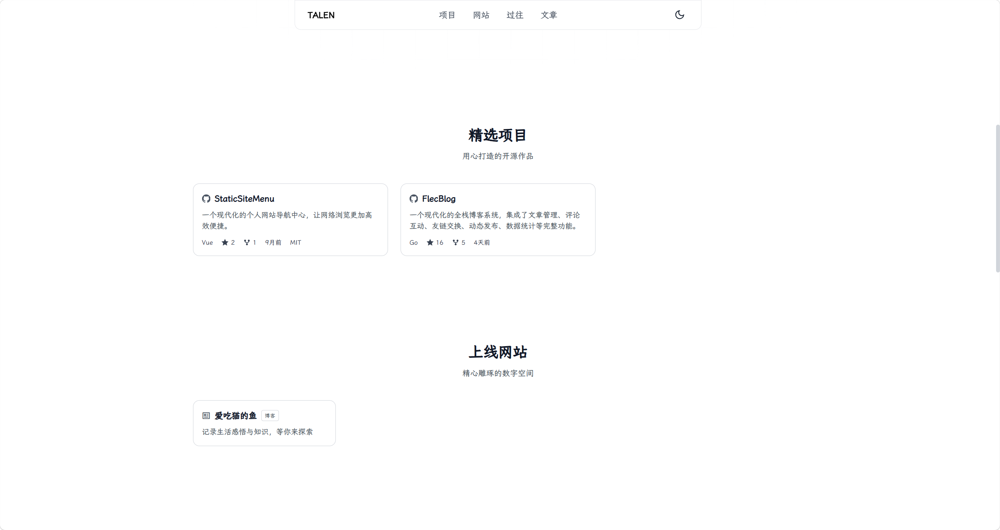
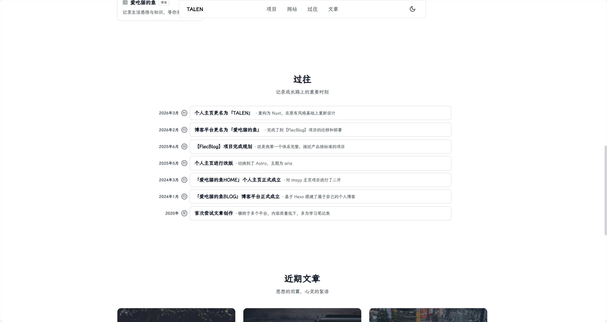

<div align="center">
  

  <h1>FlecHome</h1>

  <p>
    一个有质感、不花哨的个人主页展示项目。
  </p>

  <p>
    不追求复杂的交互，
    只把信息与排版打磨得清晰、梳理得漂亮。
  </p>

  <p>
    <a href="https://talen.top">在线预览</a> /
    <a href="https://github.com/talen8/FlecHome/issues/new">问题反馈</a> /
    <a href="https://qm.qq.com/q/Zzm9XN6lOi">社群交流</a>
  </p>

  <p>
    
    
    
    
    
  </p>
</div>

## 关于

FlecHome 是一个简洁的个人主页项目，基于 Nuxt 4 静态站点生成（SSG）模式构建。

把个人简介、项目展示、网站展示、博客文章和时间线整合在一个干净的页面里，让访客能快速了解你。

**为什么选择 FlecHome**

- 静态站点生成，部署简单、加载快速
- YAML 配置文件，修改配置便捷、集中
- 响应式设计，完美适配桌面端和移动端
- 简洁优雅的暗色主题

## 预览

| 首页首屏 | 文章展示 |
| --- | --- |
|  |  |

| 项目展示 | 时间线 |
| --- | --- |
|  |  |

## 技术栈

- [Nuxt 4](https://nuxt.com) - Vue.js 全栈框架，静态站点生成
- Vue 3 - 渐进式前端框架
- TypeScript - 类型安全的 JavaScript
- Sass - CSS 预处理器
- RemixIcon - 开源图标库
- js-yaml - YAML 配置文件解析

## 快速开始

### 安装依赖

```bash
npm install
```

### 开发模式

```bash
npm run dev
```

访问 http://localhost:3001

### 构建静态文件

```bash
npm run generate
```

输出目录为 `.output/public`

### 预览构建结果

```bash
npm run preview
```

## 配置说明

编辑项目根目录的 `config.yaml` 文件来定制你的个人主页。

```yaml
# 站点基础信息
site:
  title: TITLE                      # 网站标题
  favicon: /favicon.png             # 网站图标
  description: 个人主页描述          # SEO 描述
  keywords: [关键词1, 关键词2]       # SEO 关键词
  author: 作者名                     # 作者名称
  url: https://example.com          # 网站地址

# 首页首屏
hero:
  badgeText: 状态文本                # 顶部徽章
  descriptions:                     # 描述文案
    - 描述行1
  skills:                           # 技术栈列表
    - Vue.js
  primaryAction:                    # 主按钮
    text: 按钮文字
    url: https://example.com
  socialLinks:                      # 社交链接
    - name: GitHub
      url: https://github.com/xxx
      icon: ri-github-fill          # RemixIcon 图标名
  rightPhoto:                       # 右侧照片区域
    image: /photo.jpg               # 个人照片
    iconA: ri-code-s-slash-line     # 浮动装饰图标 A
    iconB: ri-palette-line          # 浮动装饰图标 B
    iconC: ri-rocket-2-line         # 浮动装饰图标 C

# 页脚
footer:
  startYear: 2026                   # 站点创立年份
  icp:                              # 备案信息
    - label: 备案号
      url: https://beian.miit.gov.cn/

# 文章
articles:
  blogUrl: https://blog.xxx.com                 # 博客地址
  postAPI: https://api.xxx.com/api/v1/articles  # 文章 API（三选一，FlecBlog文章API接口）
  postRSS: https://blog.xxx.com/rss.xml         # 文章 RSS（三选一，RSS 订阅地址）
  postList:                                     # 文章列表（三选一，手动填写标题、链接等）
    - title: 文章标题
      cover: /cover.jpg
      description: 文章简介
      category: 分类
      time: 2026-01-01
      url: https://blog.xxx.com/xxx

# 网站收藏
sites:
  - name: 网站名称
    description: 网站描述
    url: https://example.com
    icon: icon-name
    tag: 标签

# GitHub 项目
projects:
  - username/repo                   # GitHub 仓库地址

# 时间线
timeline:
  - date: 2026年3月
    title: 事件标题
    description: 事件描述
    icon: ri-event-line
```

> ⚠️ 每次修改 `config.yaml` 文件后，都需要重新预览，或者构建部署。

## 部署

```bash
npm run generate
```

将 `.output/public` 目录内容托管到任意静态服务（Vercel、Cloudflare等）

## 目录结构

```
FlecHome/
├── app/                    # 应用源码
│   ├── components/         # Vue 组件
│   ├── composables/        # 组合式函数
│   └── app.vue             # 根组件
├── public/                 # 静态资源
│   ├── favicon.png
│   └── photo.jpg
├── types/                  # TypeScript 类型定义
│   └── index.ts
├── utils/                  # 工具函数
├── config.yaml             # 站点配置
├── nuxt.config.ts          # Nuxt 配置
└── package.json
```

## 许可证

[MIT License](LICENSE)

## 联系方式

- Email: [talen2004@163.com](mailto:talen2004@163.com)
- Issues: [GitHub Issues](https://github.com/talen8/FlecHome/issues)
